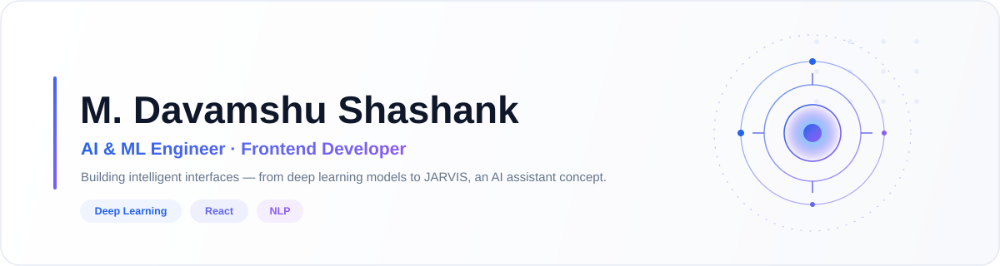

 

 

<table align="center">
<tr>
<td align="center">

I design and build intelligent, AI-driven interfaces — from deep learning models that classify images and text, to conversational assistants inspired by **JARVIS**.
Currently pursuing a **B.Tech in AI & ML at JNTUK**, graduating 2027.

</td>
</tr>
</table>

&nbsp;

 

## About Me

<table align="center" width="100%">
<tr>
<td width="33%" valign="top" align="center">
 

### ✨ AI &amp; ML

Deep learning, CNNs, NLP and computer vision applied to real datasets.

 
</td>
<td width="33%" valign="top" align="center">
 

### 💻 Frontend

React-driven interfaces with motion, polish and real usability.

 
</td>
<td width="33%" valign="top" align="center">
 

### 🚀 Always Shipping

From mini data-viz projects to full assistant concepts — building constantly.

 
</td>
</tr>
</table>

 

<table align="center" width="100%">
<tr>
<td align="center" width="25%">

### 4+
AI Projects

</td>
<td align="center" width="25%">

### 2027
Graduating

</td>
<td align="center" width="25%">

### 7.0
CGPA

</td>
<td align="center" width="25%">

### JARVIS
Flagship Build

</td>
</tr>
</table>

## Tech Stack

**Frontend**

  

**Programming &amp; Data**

  

**AI / ML**

 

<table align="center" width="100%">
<tr><td>

**Frontend**  ████████████████████░░ HTML `92%` &nbsp;·&nbsp; ███████████████████░░░ CSS `88%` &nbsp;·&nbsp; █████████████████░░░░░ JavaScript `80%` &nbsp;·&nbsp; ████████████████░░░░░░ React `74%`

**Programming**  ██████████████████░░░░ Python `85%` &nbsp;·&nbsp; █████████████████░░░░░ SQL `80%` &nbsp;·&nbsp; █████████████████░░░░░ C `78%` &nbsp;·&nbsp; ███████████████░░░░░░░ Java `70%`

**AI / ML**  ██████████████████░░░░ ML `83%` &nbsp;·&nbsp; █████████████████░░░░░ Deep Learning `76%` &nbsp;·&nbsp; ████████████████░░░░░░ Computer Vision `74%` &nbsp;·&nbsp; ███████████████░░░░░░░ NLP `72%`

</td></tr>
</table>

## Featured Projects

<table align="center" width="100%">
<tr>
<td width="33%" valign="top">

<h3 align="center">🖼️ Image Classification</h3>

<b>Computer Vision</b>

A CNN-based deep learning model that classifies images into categories with high accuracy — trained, tuned, and evaluated end to end.

</td>
<td width="33%" valign="top">

<h3 align="center">📝 Text Classification</h3>

<b>NLP</b>

An NLP model that categorizes text using machine learning — turning unstructured language into structured, actionable labels.

</td>
<td width="33%" valign="top">

<h3 align="center">🤖 Responsive AI</h3>

<b>Conversational AI</b>

A modern, AI-powered chatbot interface designed to feel fluid across every screen size — fast responses, clean state handling, no clutter.

</td>
</tr>
</table>

## Currently Designing — JARVIS

<table align="center" width="100%">
<tr>
<td align="center">

An AI assistant concept bringing together NLP, automation, and frontend craft into one cohesive system.

| Capability | Status |
|:--|:--:|
| 🗣️ Natural language conversation | ✅ |
| ⚙️ Task &amp; workflow automation | ✅ |
| 🔎 Live web search integration | ✅ |
| 🎙️ Voice interaction layer | ✅ |

</td>
</tr>
</table>

## GitHub Analytics

 

  

## Education

<table align="center" width="100%">
<tr><td>

**B.Tech — Artificial Intelligence &amp; ML**
JNTUK &nbsp;·&nbsp; 2023 – 2027 &nbsp;·&nbsp; CGPA 7.0

**Intermediate (MPC)**
Race Junior College, Kurnool &nbsp;·&nbsp; 698 / 1000

**SSC — 10th Class**
Montessori High School, Kurnool &nbsp;·&nbsp; 97.5%

</td></tr>
</table>

## Achievements &amp; Experience

<table align="center" width="100%">
<tr><td>

🏢 **AI Intern** — Alfido Tech — worked on real-world AI &amp; ML projects, applying classroom theory to applied problems

🛠️ **Java 8 &amp; Collections Workshop** — V CUBE Software Solutions

📊 **COVID-19 Dataset Visualization** — analyzed and ranked the top 10 countries by death toll using Python &amp; Matplotlib

</td></tr>
</table>

### 💬

<table>
<tr><td align="center">

<i>"The best interfaces don't just show intelligence — they make it feel effortless."</i>

</td></tr>
</table>

 

 

  

